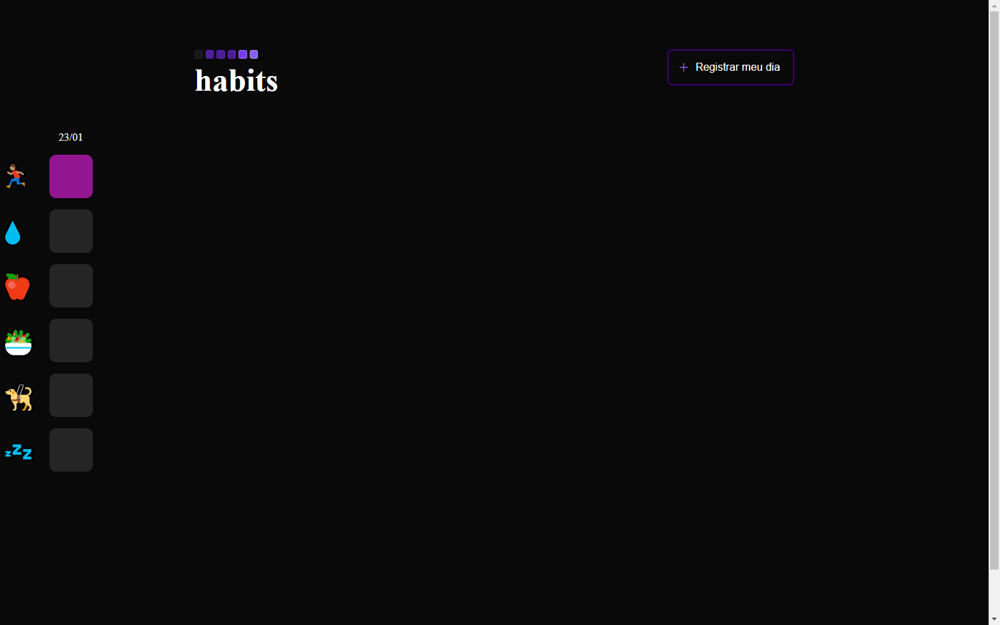

<h1 style="text-align: center">Nlw-Habits</h1>

  

## 🚀 Technologies

These project was developd with the following thecnologies:

- HTML and CSS
- JavaScript
- Git and Github

## 💻 Project

This project was developed to emulate a habit tracking program,keeping stored data of everyone that uses it through local storage, and adding a new column using a register button that takes the day and month in real time. You can check the projech [HERE](https://bpcampos.github.io/nlw-habits/)
